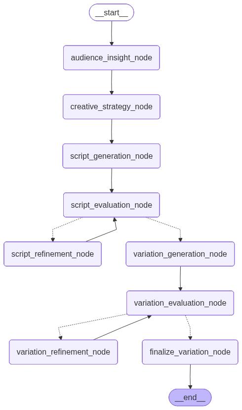

# Ads Copywriting Agent

[](https://opensource.org/licenses/MIT)


> The main goal of this project is to automate the creation of high-quality and effective social media ads content.

When it comes to AI copywriting, LLMs can certainly help, but their responses are almost **never ready for real-world application on the first try**. I've aimed to overcome this by creating a sophisticated orchestration of different LLMs. This system strategically plans, brainstorms, writes, and corrects content, ensuring quality and effectiveness are achieved automatically. The goal is to make AI more efficient for social media marketing content creation.

---

## Table of Contents

- [System Orchestration](#system-orchestration)
- [Prerequisites](#prerequisites)
- [Installation](#installation)
- [Known Issues & Limitations](#known-issues--limitations)

---

## System Orchestration

In this system multi-agent system, the complex process of effective copywriting has been modularized. By assigning each step to a different LLM, we can have more control over the reasoning and creative process. This strategic orchestration ensures a higher standard of quality and more reliable output compared to a single, generalized model. The workflow is structured as follows:



1.  **Input Collection:** The user provides crucial campaign details, including:
    * **Campaign goal**
    * **Ad platform**
    * **Product details:** name, description, features, unique selling points, and problems solved by the product
    * **Target audience:** age range, gender, location, income range, education, lifestyle, pain points, and aspirations for using the product
    * **Creative approach:** the messaging angle for ads
    * **Script tone**

2.  **Audience Insight Node (Market Researcher):** This node acts as an expert **market researcher** and **audience profiler**. Its core responsibility is to **synthesize** the initial user input to create a deeper, more actionable understanding of the audience. It goes beyond simple demographics to infer their psychographics, including daily routines, online behaviors, core values, and decision-making processes.

3. **Creative Strategy Node (Marketing Strategist):** Acting as a skilled **Marketing Strategist** and **Creative Director**, this node takes the in-depth audience insights and campaign details to build a comprehensive creative plan. Its main job is to transform raw data into actionable ad strategies. It defines the core messaging pillars, brainstorms hooks, generates compelling CTAs, and identifies specific emotional triggers to be used in the ad. This strategic output serves as the blueprint for subsequent nodes, ensuring the final ad copy is purposeful and aligned with marketing goals.

4.  **Script Generation Node (Ad Scriptwriter):** This node operates as an expert **Scriptwriter**. Its role is to take the strategic blueprint from the previous node and the initial user input to generate a full, ready to use ad script. This node's output is conditional based on the ad platform: it produces a detailed, scene-by-scene video script for dynamic platforms (like Instagram Reels or TikTok) and a concise body of copy with image details for static platforms (like Facebook or Instagram feeds). It ensures the final content is tailored to the specific platform, tone, and creative strategy, including key messages, hooks, and CTAs.

5.  **Script Evaluation Node (Ad Script Evaluator):** This node functions as an **Ad Script Evaluator**. Its primary role is to assess the generated script draft against all preceding inputs, including the original campaign brief, the creative strategy, and the detailed audience insights. The evaluation is scoring the script on multiple criteria such as **hook effectiveness**, **clarity**, **emotional appeal**, and **platform compliance**. The core responsibility of this node is to determine if the script is ready for the next stage of the workflow. If the script does not meet the high-quality standards (e.g., scores are too low), this node provides highly specific, actionable feedback and recommendations in a "change THIS to THAT" format. This feedback is designed to be a direct guide for the next node, ensuring the script can be revised to a production-ready quality.

6. **Script Refinement Node (Ad Script Refiner):** This node is an expert **Ad Script Refiner**. Its sole purpose is to take the script and the actionable feedback from the **Script Evaluation Node** and iteratively improve it. It operates on a "change THIS to THAT" logic, meticulously implementing the precise recommendations provided to elevate the script's quality. This node focuses exclusively on revision, not on new creative generation. It directly modifies the script's content—such as body copy, on-screen text, or visual descriptions—until it meets the high standards for final approval, ensuring the final output is a polished, production-ready ad script.

---

## Prerequisites

- **Python 3.11+**
- **Git**
- **Gemini or OpenAI API key**: The project relies on API keys from both Google's **Gemini** and OpenAI's **GPT** models. If you only have one of these keys, you can edit the code inside `src/agent/nodes` to use your preferred model for each node.***

## Installation
To get your project set up and running, you'll need to follow a few straightforward steps. 

1.  **Clone the repository:**
    ```bash
    git clone https://github.com/PeymanKh/ad_script_writing_agent.git
    cd ad_script_writing_agent
    ```

2.  **Install dependencies:**
    You'll need to install all the required Python libraries.
    ```bash
    pip install -r requirements.txt
    ```

3.  **Set up environment variables:**
    This project requires various API keys and configuration settings. You must create a `.env` file and populate it with your personal keys.
    ```bash
    cp .env.example .env
    ```
    Open the newly created `.env` file and replace the placeholder values with your actual API keys. You will need to provide API keys from both Google and OpenAI to run the application. or you can change codes inside `src/agent/nodes` to use your preferred model for each node.

4.  **Run the application:**
    The application runs via a Streamlit web interface. Use the following command to start it.
    ```bash
    streamlit run app.py
    ```
    Once the command runs, a new tab will open in your browser showing the application.

---
## Known Issues & Limitations

> **MVP Status**: This system is currently in MVP (Minimum Viable Product) stage and **is not production-ready**. Several architectural improvements are needed before deploying in production environments.

### 1. Manual Human-in-the-Loop Implementation

**Current Issue**: The human-in-the-loop functionality is manually implemented rather than using LangGraph's native API capabilities.

**Problem**: This approach lacks the robustness and persistence features that LangGraph's built-in `interrupt()` and `Command` system provides, including persistent execution state and flexible integration points.

**Better Approach**: Implement LangGraph's native human-in-the-loop patterns using:
- `interrupt()` for dynamic pausing based on script quality scores  
- `Command(resume=...)` for human approval/rejection workflows
- Static interrupts (`interrupt_before`/`interrupt_after`) at key nodes like Script Evaluation

### 2. Infinite Refinement Loop Problem

**Current Issue**: The automated refinement process frequently enters infinite loops where the LLM continuously refines scripts without reaching acceptable quality thresholds.

**Current Workaround**: Hard limit of 3 review cycles, which often results in suboptimal output quality.

**Limitations of Current Approach**:
- Scripts may still be below production quality after 3 iterations
- No mechanism for human intervention when automated refinement fails  
- Wastes computational resources on unproductive refinement cycles

**Proposed Solutions** (Requires Research):
- **Adaptive threshold adjustment**: Lower quality thresholds after each failed iteration
- **Human escalation**: Trigger human-in-the-loop when refinement cycles exceed 2 iterations
- **Multi-model approach**: Switch to different LLM models for refinement after failed attempts
- **Semantic similarity checks**: Stop refinement when changes become minimal between iterations

### 3. Production Readiness Gaps

**Additional Areas Requiring Development**:
- **Error handling**: Limited error recovery mechanisms for API failures
- **Performance optimization**: No caching or parallel processing for multiple campaign generation  
- **Quality validation**: Lacks comprehensive testing framework for output quality assessment
- **Scalability**: Current architecture doesn't support concurrent user sessions effectively

### 4. Research Opportunities

<details>
<summary>Areas for Future Development</summary>

**Human-in-the-Loop Integration**: Implementing LangGraph's `interrupt` patterns for approval workflows, particularly at the Script Evaluation stage.

**Refinement Optimization**: Developing smarter stopping criteria and quality assessment algorithms to prevent infinite loops while maintaining high output standards.

**Quality Metrics**: Research into automated quality scoring systems that better correlate with human evaluation of ad copy effectiveness.

</details>
